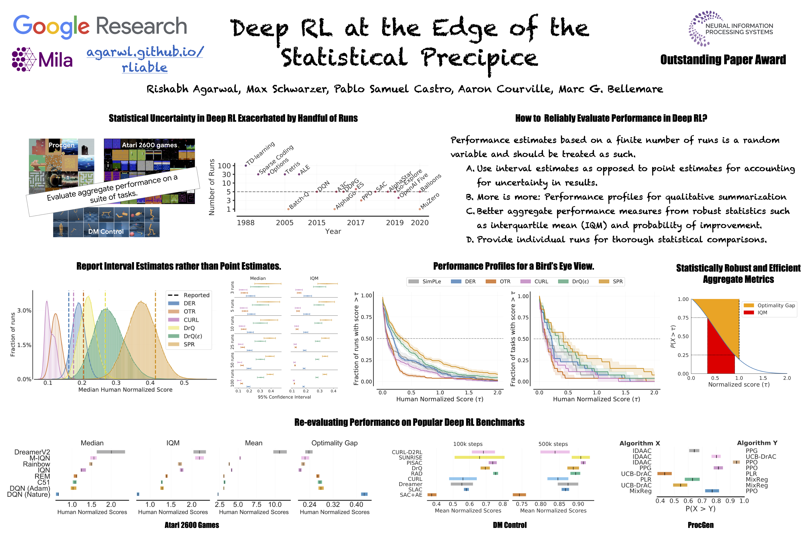

<iframe align="center" width="700" height="400" src="https://www.youtube.com/embed/XSY9JwqD-bw" title="YouTube video player" frameborder="0" allow="accelerometer; autoplay; clipboard-write; encrypted-media; gyroscope; picture-in-picture" allowfullscreen></iframe>

  

This work argues for an alternative approach to RL research, where we build on prior computational work, which we believe could significantly improve real-world RL adoption and help democratize it further.

Citing
------
To cite this paper, please use the following reference:

     @article{agarwal2022beyond,
      title={Beyond Tabula Rasa: Reincarnating Reinforcement Learning},
      author={Agarwal, Rishabh and Schwarzer, Max and Castro, Pablo Samuel and Courville, Aaron and Bellemare, Marc G},
      journal={arXiv preprint arXiv:2206.01626},
      year={2022}
    }

## Authors



  
  <a href="{{ person.url | relative_url }}">{{ person.name }}</a> 
  {{ person.title | replace: '&', ' ' }}
  <!--span>({{ person.topics }})</span-->



For questions, please contact us at:
<a href="mailto:rishabhagarwal@google.com">rishabhagarwal@google.com</a>.

